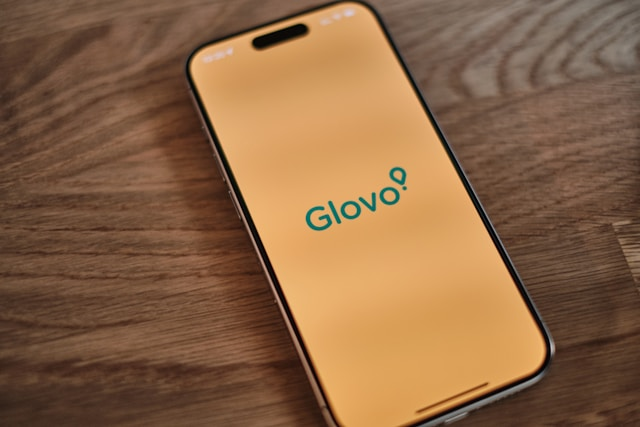

# Glovo clone - Nuxt 3 + Vite + Typescript 


 
 <!-- PROJECT LOGO -->   
<br />
<p align="center">
  <a href="https://github.com/ChristianPredoianu/glovo-clone-nuxt3-vitest">
    
  </a> 
 
  <h3 align="center">Glovo clone</h3>
   
  <p align="center">
    <a href="https://github.com/ChristianPredoianu/glovo-clone-nuxt3-vitest"><strong>Explore the docs »</strong></a>
    <br />
    <br />
    <a href="https://glovoclonenuxt3.netlify.app/">View Demo</a>
    ·
    <a href="https://github.com/ChristianPredoianu/glovo-clone-nuxt3-vitest/issues">Report Bug</a>
  </p>
</p>

  

<!-- TABLE OF CONTENTS -->
<details open="open">
  <summary><h2 style="display: inline-block">Table of Contents</h2></summary>
  <ol>
    <li>
      <a href="#about-the-project">About The Project</a>
      <ul>
        <li><a href="#built-with">Built With</a></li>
      </ul>
    </li>
    <li>
      <a href="#getting-started">Getting Started</a>
      <ul>
        <li><a href="#prerequisites">Prerequisites</a></li>
        <li><a href="#installation">Installation</a></li>
      </ul>
    </li>
    <li><a href="#usage">Usage</a></li>
    <li><a href="#license">License</a></li>
    <li><a href="#contact">Contact</a></li>
    <li><a href="#acknowledgements">Acknowledgements</a></li>
  </ol>
</details>


<!-- ABOUT THE PROJECT -->
## About The Project

A clone of the Glovo delivery app built with Nuxt 3 and Vitest.

### Built With

* [Nuxt](https://nuxt.com/)
* [Typescript](https://reactrouter.com/en/main)
* [Vite](https://vitejs.dev/)
* [Vitest](https://vitest.dev/)
* [Vue test utils](https://test-utils.vuejs.org/)
* [HTML5](https://developer.mozilla.org/en-US/docs/Glossary/HTML5)
* [TailwindCss](https://tailwindcss.com/)
* [Firebase](https://firebase.google.com/)


<!-- GETTING STARTED -->
## Getting Started

To get a local copy up and running follow these simple steps.

### Prerequisites

* npm
  ```sh
  npm install npm@latest -g
  ```

### Installation

1. Clone the repo
   ```sh
   git clone https://github.com/ChristianPredoianu/glovo-clone-nuxt3-vitest.git
   ```
2. Install NPM packages
   ```sh
   npm install
   ``` 
3. Serve with hot reload at localhost
   ```sh
    npm run dev
   ``` 
5. Build for production 
   ```sh
    npm run build
   
   ```

<!-- USAGE EXAMPLES -->
## Usage
Filter meals, products. Add items to your cart, and proceed to checkout. Enjoy a seamless delivery experience similar to Glovo.


<!-- LICENSE -->
## License

Distributed under the MIT License. See `LICENSE` for more information.


<!-- CONTACT -->
## Contact

Christian Predoianu - [@linkedin](https://se.linkedin.com/in/christian-predoianu-369218157) - christianpredoianu@yahoo.com

Project Link: [https://github.com/ChristianPredoianu/glovo-clone-nuxt3-vitest](https://github.com/ChristianPredoianu/glovo-clone-nuxt3-vitest)


<!-- ACKNOWLEDGEMENTS --> 
## Acknowledgements
* [Google Fonts](https://fonts.google.com/)
* [Font-Awesome](https://fontawesome.com/)

